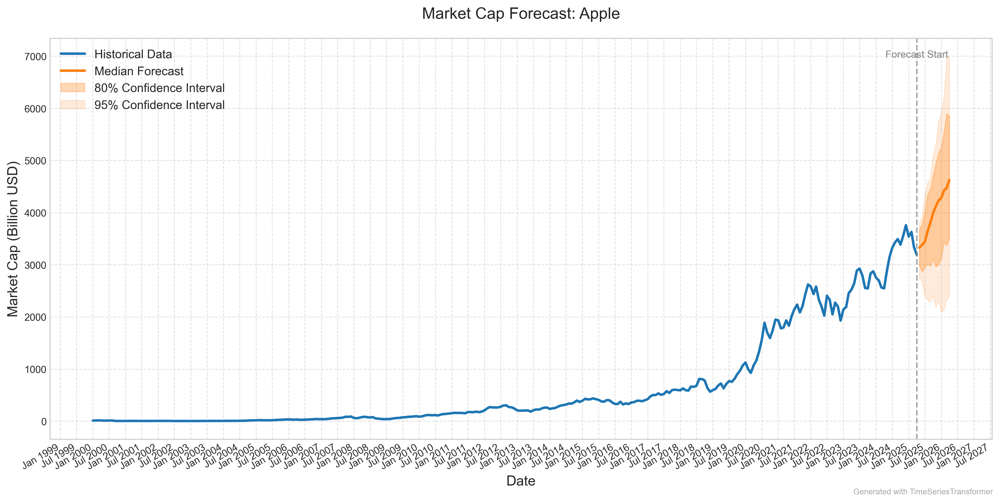

# Market Capitalization Forecasting

## Overview

This project provides a comprehensive pipeline for forecasting market capitalization of companies using various time series forecasting techniques, including:

- Transformer-based models (TimeSeriesTransformer)
- ARIMA models
- RNN models

The system fetches market cap data from Yahoo Finance, processes it into a time series format, trains multiple forecasting models, and generates predictions with evaluation metrics.

## Project Structure

```
marketcap-forecasting/
├── data_preparation/
│   ├── fetch_data.py            # Fetches market cap data from Yahoo Finance
│   ├── prepare_dataset.py       # Processes raw data into time series format
│   └── check_for_nan.py         # Validates data quality
├── forecasting/
│   ├── train.py                 # Trains the TimeSeriesTransformer model
│   ├── test_model.py            # Evaluates the trained model
│   ├── forecast_future.py       # Generates future forecasts
│   ├── ARIMA.py                 # ARIMA model implementation
│   └── RNN.py                   # RNN model implementation
├── visualization/
│   └── plot_marketcap_data.py   # Visualizes market cap trends
├── market_cap_data/             # Directory for raw market cap data
├── prepared_marketcap_dataset/  # Processed dataset directory
├── saved_models/                # Saved models directory
└── saved_forecasts/             # Saved forecasting results
```

## Key Features

1. **Data Pipeline**

   - Automated data fetching from Yahoo Finance
   - Time series preprocessing and validation
   - Static feature encoding (sector, industry, market cap category)

2. **Modeling Approaches**

   - State-of-the-art Time Series Transformer
   - Traditional ARIMA models
   - Recurrent Neural Networks (RNNs)

3. **Evaluation Metrics**

   - MASE (Mean Absolute Scaled Error)
   - sMAPE (Symmetric Mean Absolute Percentage Error)
   - MAPE (Mean Absolute Percentage Error)

4. **Visualization**
   - Interactive forecast plots
   - Model performance comparisons
   - Time series trend analysis

## Getting Started

### Prerequisites

- Python 3.8+
- Required packages: `pip install -r requirements.txt`

### Basic Usage

1. **Fetch Data**

   ```bash
   python fetch_data.py
   ```

2. **Prepare Dataset**

   ```bash
   python prepare_dataset.py
   ```

3. **Train Model**

   ```bash
   python train.py
   ```

4. **Evaluate Model**

   ```bash
   python test_model.py
   ```

5. **Generate Forecasts**
   ```bash
   python forecast_future.py
   ```

## Model Comparison

| Model Type            | Strengths                                          | Best For                |
| --------------------- | -------------------------------------------------- | ----------------------- |
| TimeSeriesTransformer | Captures complex patterns, handles multiple series | Large-scale forecasting |
| ARIMA                 | Simple, interpretable                              | Short-term forecasts    |
| RNN                   | Handles sequential dependencies                    | Medium-term forecasts   |

## Results

Example forecast for Apple Inc.:


## License

This project is licensed under the MIT License - see the [LICENSE](LICENSE) file for details.
